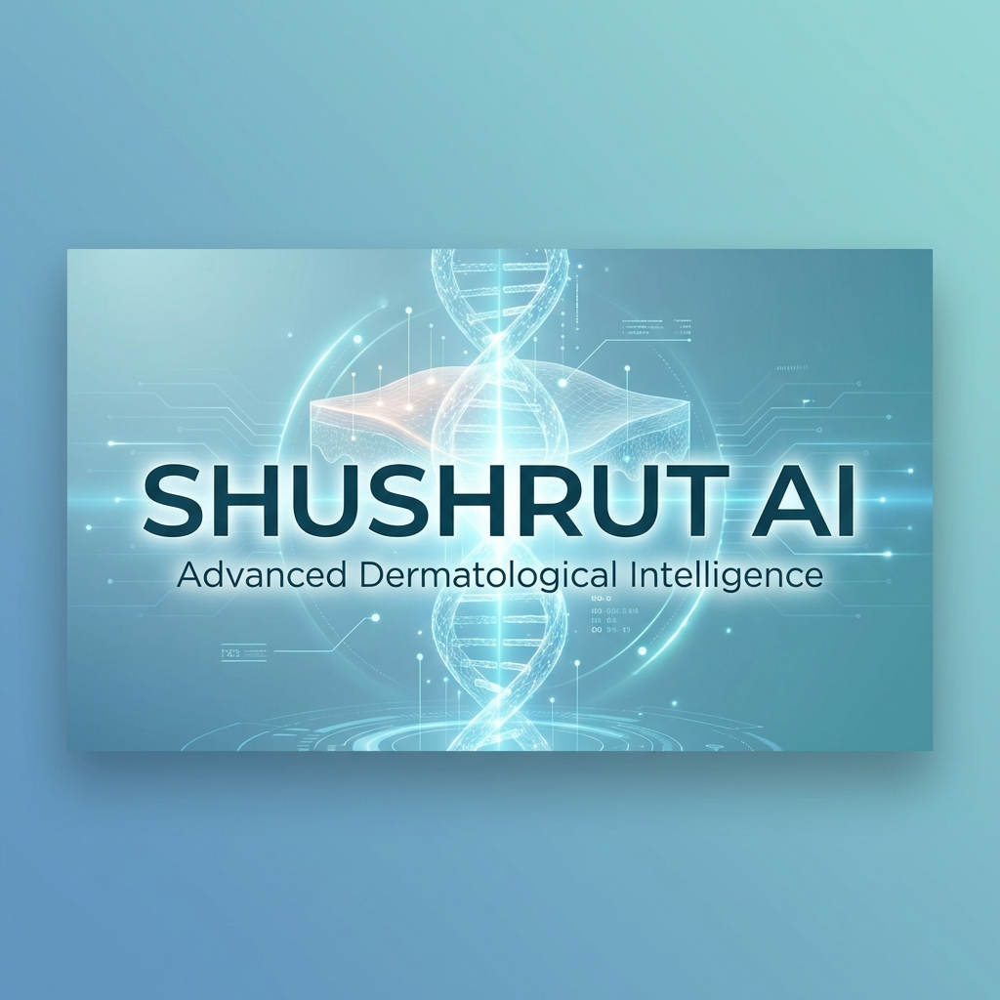

<div align="center">
  

  # Shushrut AI
  <h3>Advanced Dermatological Intelligence</h3>

  <p>
    <a href="https://github.com/vdt1905/GDG-2025-26/actions/workflows/ci-cd.yml"></a>
    <a href="https://github.com/vdt1905/GDG-2025-26/stargazers"></a>
    <a href="https://github.com/vdt1905/GDG-2025-26/issues"></a>
    <a href="https://github.com/vdt1905/GDG-2025-26/blob/main/LICENSE"></a>
    
  </p>

  <p>
    <b>Revolutionizing Dermatology with Multi-Agent AI</b><br>
    <i>Detect. Diagnose. Treat. Voice-Assisted.</i>
  </p>
</div>

---

## 🚀 About The Project

**Shushrut AI** is a state-of-the-art dermatological platform designed to empower doctors and patients with instant, AI-driven skin analysis. Named after *Sushruta*, the father of plastic surgery, this tool blends ancient wisdom with cutting-edge **Generative AI**.

It goes beyond simple classification. Shushrut AI employs a **Multi-Agent System** where specialized AI agents collaborate to verify symptoms, cross-reference diseases, generate comprehensive medical reports, and even provide voice-guided consultation via "Jarvis".

### 🌟 Key Features

*   **🔍 Precision Diagnostics:** Hybrid analysis using Deep Learning (CNNs/ViTs) and Gemini 1.5 Pro/Flash.
*   **🤖 Multi-Agent Architecture:**
    *   **Verify Agent:** Filters non-skin images and assesses general health.
    *   **Pathology Agent:** Detailed analysis of unhealthy skin conditions.
    *   **Report Agent:** Generates professional-grade medical reports (Markdown/PDF).
    *   **Jarvis Agent:** Voice-interactive assistant for doctors to discuss cases.
*   **🗣️ Voice Assistant:** "Jarvis" provides real-time, evidence-based answers to medical queries.
*   **📄 PDF Report Generation:** Automatic, downloadable PDF reports for patient records.
*   **👥 Team Dashboard:** Collaborative environment for medical teams.

---

## 🛠️ Tech Stack

### Frontend
   

### Backend
   

### AI & Data Science
   

---

## 🧠 The Multi-Agent Workflow

1.  **Input:** Patient uploads a skin image.
2.  **Visual Sentry (Models):** Custom trained CNN/ViT models provide initial classification confidence.
3.  **Agent 1 (Verify):** Confirms image validity and assesses general skin health.
4.  **Agent 2 (Diagnosis):** Deep dives into potential pathologies if unhealthy.
5.  **Agent 3 (Report):** Synthesizes all data into a structured clinical report.
6.  **Agent 4 (Jarvis):** Reads the report and stands by for voice Q&A.

---

## ⚡ Getting Started

Follow these steps to set up the project locally.

### 🐳 Quick start with Docker

Runs all three services with one command. You need the same local secrets as the manual setup below (none of them are committed to git):

| File | Contents |
|---|---|
| `backend/serviceAccountKey.json` | Firebase Admin key, shared by the backend and the AI service |
| `backend/.env` | `CLOUDINARY_CLOUD_NAME`, `CLOUDINARY_API_KEY`, `CLOUDINARY_API_SECRET` |
| `PYTHON/.env` | `GOOGLE_API_KEY`, `SARVAM_API_KEY` |
| `frontend/.env` | `VITE_FIREBASE_*` web config |

```bash
docker compose up --build     # first run: ~3 min to build
```

| Service | URL |
|---|---|
| Frontend | http://localhost:3000 |
| Backend API | http://localhost:5000 |
| AI service | http://localhost:8000 |

Secrets are mounted or injected when the containers start, so they are never baked into an image. Stop everything with `docker compose down`.

> The frontend build hard-codes the API URLs (Vite inlines `VITE_*` at build time). If you change the ports in `docker-compose.yml`, change the frontend `build.args` to match and rebuild with `--build`.

### Prerequisites
*   Node.js (v16+)
*   Python (v3.9+)
*   Firebase Project (Service Account Key)
*   Google Gemini API Key

### Installation

#### 1. Clone the Repository
```sh
git clone https://github.com/vdt1905/GDG-2025-26.git
cd GDG-2025-26
```

#### 2. Backend Setup
```sh
cd backend
npm install
# Add your serviceAccountKey.json in the backend root
# Create .env file with Cloudinary & Firebase credentials
npm run dev
```

#### 3. Frontend Setup
```sh
cd frontend
npm install
# Create .env with VITE_API_BASE_URL=http://localhost:5000
npm run dev
```

#### 4. AI Service Setup
```sh
cd PYTHON
python -m venv venv
source venv/bin/activate  # On Windows: venv\Scripts\activate
pip install -r requirements.txt
# Create .env with GOOGLE_API_KEY
python main.py
```

---

## 👥 Contributors

**Team DOMinators**

*   Nisarg
*   Vansh
*   Krish
*   Heli
*   Rahul


---

<div align="center">
  <small>Made with ❤️ by Team DOMinators</small>
</div>
